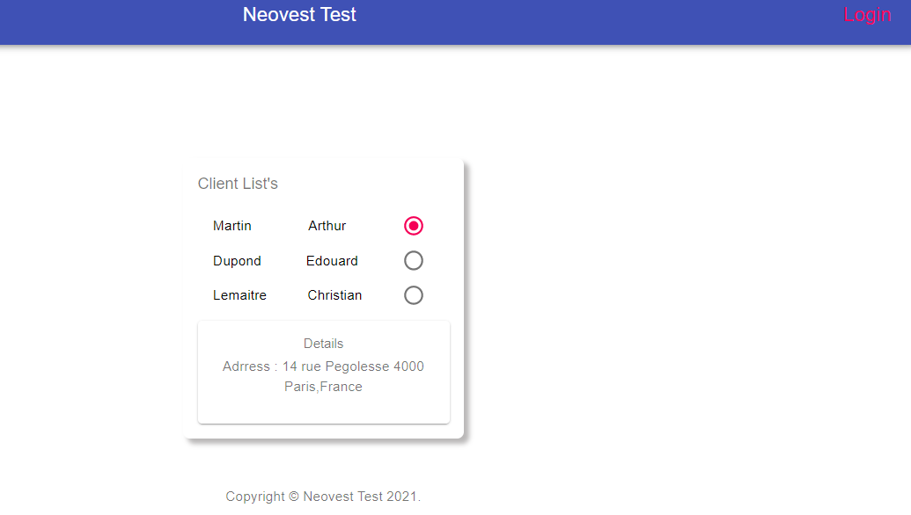
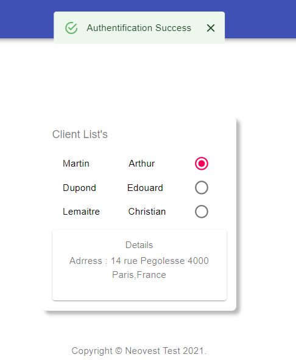

# Neovest Test APp
  
# Features
  * Authentication page with the username/password.
  * List of client's.

# Front-end
  * React.js (+hooks)
  * Material-ui
# Prerequisites
  node, npm
# Running the app
```
npm install
npm start
```
# Pictures
* Home


* Login


# Authors
ISMAIL BOUROUMMANA
